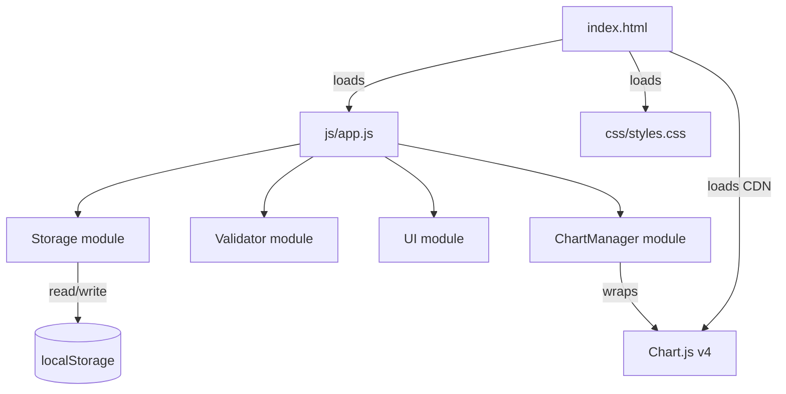

# Design Document — Expense & Budget Visualizer

## Overview

The Expense & Budget Visualizer is a pure client-side single-page application that lets users record personal expense transactions, monitor a running total balance, and visualize category-level spending through a pie chart. There is no backend, no build pipeline, and no framework dependency. All data is persisted in the browser's `localStorage`.

The deliverable is three files:

| File | Role |
|---|---|
| `index.html` | Single page shell; loads CSS and JS |
| `css/styles.css` | All visual styling |
| `js/app.js` | All application logic |

Chart rendering delegates to **Chart.js v4** loaded from a CDN, which removes the need to implement a canvas-drawing engine from scratch.

### Key Design Decisions

- **Single JS file, module-style organization** — `js/app.js` is structured as a collection of plain-object namespaces (e.g., `Storage`, `Validator`, `UI`, `Chart`) wrapped in a `DOMContentLoaded` listener. This gives clean separation of concerns without requiring ES modules or a bundler.
- **Chart.js over hand-rolled canvas** — Chart.js v4 handles arc math, colors, legends, and responsive resizing. The app only needs to update `chart.data.datasets[0].data` and call `chart.update()`.
- **No test runner included in the deliverable** — The project is a static web page. Tests are described as properties and strategies in this document; implementation teams can add a test harness (e.g., Vitest, Jest) separately without touching the production files.

---

## Architecture

The application follows a **unidirectional data flow**:

```
User Action
    │
    ▼
Validator ──(invalid)──► UI.showErrors()
    │
  (valid)
    │
    ▼
Storage.save(transactions)
    │
    ▼
UI.renderList(transactions)
UI.renderBalance(transactions)
Chart.render(transactions)
```

All state lives in a single in-memory array, `state.transactions`, which is the single source of truth. Whenever it changes (add or delete), all three UI regions (list, balance, chart) are re-rendered from that array. Storage is written synchronously after every mutation.



---

## Components and Interfaces

### 1. `Storage` module

Responsible for reading and writing the transaction collection to `localStorage`.

```
Storage.load()  → Transaction[]   // parse JSON from localStorage; returns [] on error
Storage.save(transactions)        // serialize and write; swallows write errors gracefully
```

**localStorage key:** `"evb_transactions"`

### 2. `Validator` module

A pure-function module. No DOM access, no side effects.

```
Validator.validate(name, amount, category) → ValidationResult

ValidationResult {
  valid: boolean
  errors: {
    name?:     string   // error message if name invalid
    amount?:   string   // error message if amount invalid
    category?: string   // error message if category invalid
  }
}
```

Rules:
- `name`: non-empty string, trimmed length 1–100 characters.
- `amount`: parseable number, `0.01 ≤ value ≤ 999_999_999.99`.
- `category`: must be one of `"Food"`, `"Transport"`, `"Fun"`.

### 3. `UI` module

Handles all DOM manipulation.

```
UI.renderList(transactions)      // re-renders the full transaction list
UI.renderBalance(transactions)   // updates the balance display element
UI.showErrors(errors)            // displays inline error messages on form fields
UI.clearErrors()                 // removes all error indicators
UI.clearForm()                   // resets all form fields; sets focus to name input
UI.showStorageWarning(message)   // displays a dismissible warning banner
UI.hideStorageWarning()          // hides the warning banner
```

**Currency formatting** is a shared pure function used by both `UI.renderList` and `UI.renderBalance`:

```
formatCurrency(amount: number) → string
// e.g. formatCurrency(1234.5) === "$1,234.50"
// Uses Number.toLocaleString with minimumFractionDigits: 2, maximumFractionDigits: 2
```

**Overflow handling** for balance: if `sum > 999_999_999.99`, display `"$999,999,999.99+"`.

### 4. `ChartManager` module

Wraps the Chart.js instance. Owns the `<canvas>` element.

```
ChartManager.init(canvasElement)   // creates the Chart.js pie chart instance
ChartManager.update(transactions)  // recomputes category totals; calls chart.update()
```

Internally, `ChartManager.update` computes:
```
categoryTotals = { Food: 0, Transport: 0, Fun: 0 }
for each transaction: categoryTotals[transaction.category] += transaction.amount

activeCats = categories where categoryTotals[cat] > 0
chart.data.labels          = activeCats (or ["No data"] when empty)
chart.data.datasets[0].data   = activeCats.map(c => categoryTotals[c])  (or [1] when empty)
chart.data.datasets[0].backgroundColor = activeCats.map(c => CATEGORY_COLORS[c])  (or ["#D1D5DB"])
```

### 5. Main controller (`init` function)

Ties everything together:

```
function init() {
  state.transactions = Storage.load()
  UI.renderList(state.transactions)
  UI.renderBalance(state.transactions)
  ChartManager.init(document.getElementById('pie-chart'))
  ChartManager.update(state.transactions)
  bindEvents()
}
```

Event bindings:
- Form `submit` → validate → add transaction → save → re-render all
- Click on delete button (event delegation on list container) → remove transaction → save → re-render all

---

## Data Models

### Transaction

```js
{
  id:       string,   // UUID v4 (crypto.randomUUID())
  name:     string,   // 1–100 characters
  amount:   number,   // 0.01–999,999,999.99
  category: string    // "Food" | "Transport" | "Fun"
}
```

### AppState (in-memory only)

```js
{
  transactions: Transaction[]
}
```

### localStorage schema

The entire `transactions` array is stored as a single JSON string under the key `"evb_transactions"`:

```json
[
  { "id": "uuid", "name": "Coffee", "amount": 4.50, "category": "Food" },
  { "id": "uuid", "name": "Bus fare", "amount": 2.00, "category": "Transport" }
]
```

### Category Color Map

```js
const CATEGORY_COLORS = {
  Food:      "#F97316",  // orange
  Transport: "#3B82F6",  // blue
  Fun:       "#A855F7"   // purple
}
```

Colors are constant and never change between renders.

### File Structure

```
index.html
css/
  styles.css
js/
  app.js
```

---

## Correctness Properties

*A property is a characteristic or behavior that should hold true across all valid executions of a system — essentially, a formal statement about what the system should do. Properties serve as the bridge between human-readable specifications and machine-verifiable correctness guarantees.*

---

### Property 1: Validator accepts all valid inputs

*For any* item name (non-empty, length ≤ 100), amount (between 0.01 and 999,999,999.99), and category (one of Food, Transport, Fun), `Validator.validate` SHALL return `{ valid: true }` with no error fields.

**Validates: Requirements 1.2**

---

### Property 2: Validator rejects all invalid inputs

*For any* form input where at least one field is invalid — the name is empty or exceeds 100 characters, the amount is outside 0.01–999,999,999.99 or non-numeric, or the category is not one of the valid options — `Validator.validate` SHALL return `{ valid: false }` and the `errors` object SHALL contain an entry for every offending field.

**Validates: Requirements 1.2, 1.3, 1.6**

---

### Property 3: Valid submission grows the transaction list by exactly one

*For any* transaction list of any length N and any valid (name, amount, category) triple, adding that transaction SHALL result in a transaction list of length N + 1, and the last entry in the list SHALL contain exactly the submitted name, amount, and category.

**Validates: Requirements 1.4**

---

### Property 4: Successful add clears all form fields

*For any* valid transaction submission, once the add operation completes, all three Input_Form fields (name, amount, category) SHALL be empty/reset to their default values.

**Validates: Requirements 1.5**

---

### Property 5: Currency formatting always produces two decimal places with a dollar prefix

*For any* finite, non-negative number that is a valid transaction amount, `formatCurrency(amount)` SHALL return a string that begins with `"$"` and ends with exactly two decimal digits separated from the integer part by `"."`.

**Validates: Requirements 2.2, 3.2**

---

### Property 6: Transaction list renders exactly one delete button per transaction

*For any* list of N transactions (N ≥ 0), the rendered Transaction_List DOM SHALL contain exactly N delete button elements.

**Validates: Requirements 2.4**

---

### Property 7: Delete reduces list size by one and removes entry from storage

*For any* transaction list of size N ≥ 1, deleting any transaction by its `id` SHALL result in an in-memory list of size N − 1, that transaction SHALL no longer appear in the list, and the transaction SHALL not be present in the JSON string written to `localStorage`.

**Validates: Requirements 2.5**

---

### Property 8: Balance display always equals the formatted sum of all transaction amounts

*For any* list of transactions, the value shown in `Balance_Display` SHALL equal `formatCurrency(sum of all amounts)`. When the list is empty the balance SHALL equal `"$0.00"`.

**Validates: Requirements 3.2, 3.5**

---

### Property 9: Chart segment data contains exactly the active categories, proportional to spending

*For any* list of transactions, `ChartManager.update` SHALL produce chart dataset values such that:
- Only categories with a total > 0 appear as segments.
- Each segment value divided by the sum of all segment values equals that category's total divided by the grand total (within floating-point tolerance).
- When no transactions exist, a single placeholder segment with value 1 and color `"#D1D5DB"` is produced.

**Validates: Requirements 4.1, 4.5**

---

### Property 10: Category colors are deterministic, predefined, and mutually distinct

*For any* set of transactions and across any number of `ChartManager.update` calls, the color assigned to Food SHALL always be `"#F97316"`, Transport SHALL always be `"#3B82F6"`, and Fun SHALL always be `"#A855F7"`. No two categories SHALL ever share the same color.

**Validates: Requirements 4.2**

---

### Property 11: Legend percentages equal category share of total rounded to one decimal place

*For any* list of transactions where grand total > 0, each category's legend percentage SHALL equal `Math.round((cat_total / grand_total) * 1000) / 10` (i.e., rounded to one decimal place).

**Validates: Requirements 4.6**

---

### Property 12: localStorage round-trip restores an identical transaction collection

*For any* valid transaction array written to `localStorage` under key `"evb_transactions"` as JSON, calling `Storage.load()` SHALL return an array that is structurally equal to the original (same length, same `id`/`name`/`amount`/`category` values in the same order).

**Validates: Requirements 5.3**

---

## Error Handling

### Form Validation Errors

- Displayed as inline text nodes adjacent to each field (`<span class="field-error">`).
- Cleared on every new submission attempt before re-validation.
- Do not block access to any other part of the UI.

### localStorage Unavailability (init)

- Triggered when `localStorage` is inaccessible (private browsing on some browsers, storage quota exceeded) or when the stored value fails `JSON.parse`.
- Recovery: initialize `state.transactions = []`; display a dismissible warning banner above the form: *"Your transactions could not be loaded. Storage may be unavailable."*
- The warning does not overlap or disable any interactive control.
- The warning disappears when the user dismisses it (×) or successfully adds a new transaction.

### localStorage Write Failure (add / delete)

- The in-memory state is updated first; the UI reflects the change.
- If `localStorage.setItem` throws, the error is caught, and the transaction write is silently skipped. The data remains in memory for the session.
- A console warning is emitted: `console.warn("evb: localStorage write failed", err)`.

### Transaction Delete — Storage Failure

- Per Requirement 2.5: if storage removal fails after a delete action, the transaction is re-inserted into the in-memory list and a user-facing inline error message is shown on that list item: *"Deletion could not be saved. Please try again."*

### Chart.js Unavailability

- If the CDN script fails to load, `window.Chart` will be undefined.
- The `ChartManager.init` function checks for this and, if absent, hides the chart container and shows a fallback text: *"Chart unavailable — could not load charting library."*

---

## Testing Strategy

This feature involves pure JavaScript logic that maps inputs to outputs, making it well-suited for **property-based testing** for the core business logic. The UI rendering and performance requirements call for **example-based unit tests** and **manual/browser integration tests** respectively.

### Recommended Test Stack

| Layer | Tool |
|---|---|
| Unit + Property tests | [fast-check](https://github.com/dubzzz/fast-check) (property) + [Vitest](https://vitest.dev/) or Jest (runner) |
| DOM integration tests | [jsdom](https://github.com/jsdom/jsdom) via Vitest/Jest |
| Manual smoke tests | Browser DevTools |

> Note: No test tooling is included in the deliverable. Add a `package.json` dev-dependency configuration separately when implementing tests.

### Property-Based Tests

Each property from the Correctness Properties section maps to exactly one property-based test using fast-check. Configure each test to run **minimum 100 iterations**.

Tag format: `// Feature: expense-budget-visualizer, Property N: <property title>`

| Test | Property | fast-check Arbitraries |
|---|---|---|
| Validator accepts valid inputs | Property 1 | `fc.string({minLength:1, maxLength:100})`, `fc.float({min:0.01, max:999999999.99})`, `fc.constantFrom("Food","Transport","Fun")` |
| Validator rejects invalid inputs | Property 2 | Generate at least one invalid field per iteration |
| Valid add grows list by 1 | Property 3 | Array of valid transactions + one valid new entry |
| Add clears form fields | Property 4 | Any valid (name, amount, category) triple |
| Currency formatting | Property 5 | `fc.float({min:0, max:999999999.99})` |
| N transactions → N delete buttons | Property 6 | `fc.array(validTransactionArb, {maxLength: 50})` |
| Delete reduces list by 1 | Property 7 | `fc.array(validTransactionArb, {minLength:1})` + pick random index |
| Balance equals formatted sum | Property 8 | `fc.array(validTransactionArb)` |
| Chart segments = active categories | Property 9 | `fc.array(validTransactionArb)` |
| Category colors are deterministic | Property 10 | `fc.array(validTransactionArb)`, call update multiple times |
| Legend percentages | Property 11 | `fc.array(validTransactionArb, {minLength:1})` |
| localStorage round-trip | Property 12 | `fc.array(validTransactionArb)` |

### Example-Based Unit Tests

Focus on concrete scenarios that demonstrate correct behavior at boundaries:

- **Empty list**: balance shows `$0.00`, placeholder message visible, chart shows gray placeholder.
- **Single transaction**: all three UI regions reflect it correctly.
- **Amount with many decimal places**: `formatCurrency(1.005)` rounds correctly to `$1.01`.
- **Name exactly 100 characters**: accepted.
- **Name with 101 characters**: rejected with error message.
- **Amount = 0.01**: accepted.
- **Amount = 0**: rejected.
- **Amount = 999,999,999.99**: accepted.
- **Amount = 1,000,000,000.00**: rejected.
- **localStorage parse error on init**: warning banner shown, app functional.
- **Delete on storage failure**: transaction re-appears in list, inline error shown.
- **All categories populated**: chart has 3 segments, legend has 3 entries.
- **One category populated**: chart has 1 segment, legend has 1 entry.

### Integration / Smoke Tests (Manual, Browser)

- Open `index.html` directly (file:// protocol) in Chrome, Firefox, Edge, Safari — no console errors on load.
- Add 500 transactions; verify add operation completes without visible lag.
- Reload page; verify all 500 transactions are restored from localStorage.
- Delete all transactions; verify list shows placeholder, chart shows gray placeholder, balance shows `$0.00`.
- Disable JavaScript; verify the page degrades gracefully (out of scope for this app, noted for awareness).
